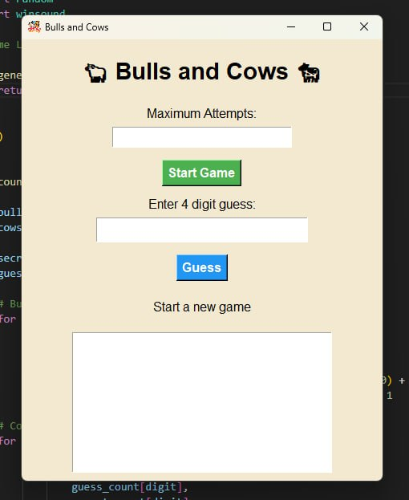

# 🐂 Bulls and Cows 🐄

Bulls and Cows is a simple and interactive number guessing game built with Python and Tkinter.

The game generates a secret 4-digit number, and the player tries to discover it within a limited number of attempts. After each guess, the game provides feedback:

- 🐂 Bulls: digits that are correct and in the right position.
- 🐄 Cows: correct digits but in the wrong position.

The application includes a graphical user interface, game history, attempt tracking, custom icon, and background music for a better experience.

## Features
- Easy-to-use desktop interface.  

- Customizable number of attempts.
- Real-time Bulls and Cows feedback.
- Guess history tracking.
- Sound and visual customization.

## Built With
- Python
- Tkinter
- Winsound

Enjoy the challenge and try to find the secret number! 🎯
